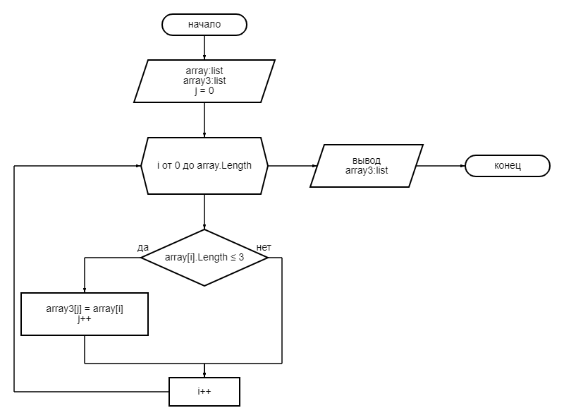

# Итоговая проверочная работа по первому блоку обучения Geebrains
**Задача:** Написать программу, которая из имеющегося массива строк формирует новый массив из строк, длина которых меньше, либо равна 3 символам. Первоначальный массив можно ввести с клавиатуры, либо задать на старте выполнения алгоритма. При решении не рекомендуется пользоваться коллекциями, лучше обойтись исключительно массивами.

**Примеры:**

[“Hello”, “2”, “world”, “:-)”] → [“2”, “:-)”]
[“1234”, “1567”, “-2”, “computer science”] → [“-2”]
[“Russia”, “Denmark”, “Kazan”] → []

## О программе

Блок-схема в папке Diagram.

### 1 блок
Сначала решается, будет ли вводиться массив вручную или будет взят автоматически из программы. Путем ввода 1 или 0 соответственно.

Создается массив и выводится на экран.
Если массив вводится вручную, то используется метод *FillArray* для заполнения массива.

### 2 блок
Затем проводится проверка длины элементов и создания нового массива из этих элементов в методе *FindArrayElementsLess3*. 

Новый массив также выводится на экран.

Для вывода массивов на экран используется метод *PrintArray*.
